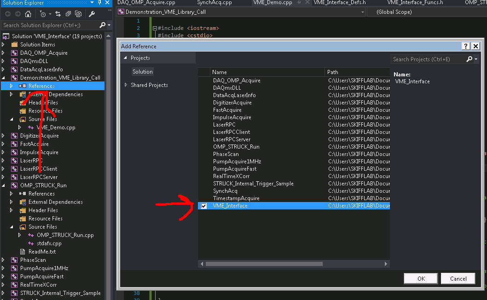

# Tutorial: Writing a C++ Program using Visual Studio to Call the VME Interface Library.
## By Sean Mattingly


This document steps the user through creating a new project in Visual Studio
that links to the already existing .DLL (or .LIB) library “VME_Interface.dll”.
This library contains a number of routines for accessing the VME interface
through V2718, setting up a data acquisition, downloading the data from the
VME, and writing the data to the hard drive. I hope the library will be a good
springboard for a student in the Skiff lab at the University of Iowa who wants
to get started acquiring his or her own data for their own experiment.

This tutorial will also show the user where the code for the VME_Interface
library is held for the future event if they want to modify it and add their
own methods to it.

Finally, we will also cover the basics of creating a project in MS Visual
Studio 2015, which includes creating the project itself, writing the C++ code,
pointing the MSVS compiler / linker to the required libraries, compiling it,
and running the resulting executable.

* * *

1.  Go to “Start” -> Open “Visual Studio 2015.” Note there are older version of VS2015; do not use them.
2.  In the Visual Studio startup screen, select “Open Project…” under “Start.” Alternatively, you can do File -> Open -> Project / Solution (Ctrl + Shift + O).

3.  In the file dialog that opens, go to “My Documents” -> “Visual Studio 2015” (NOT 2013 or 2010) -> “Projects” -> “VME_Interface” -> VME_Interface.sln. Alternatively, the full file path is C:\Users\SKIFFLAB\Documents\Visual Studio 2015\Projects\VME_Interface\VME_Interface.sln. Click “Open” to open the solution.
4.  MSVS2015 will open the full solution. There are a variety of projects inside this solution for different data acquisition processes. Before we create a new project in this solution, I want to point out the “VME_Interface” library:  In the Solution Explorer, there are a number of solutions. At the bottom (of the time of writing) is the solution “VME_Interface.” The source file “VME_Interface.cpp” contains all the methods that we can call using the DLL. The header file “VME_Interface_Funcs.h” contains the declarations of the externally usable  (“public”) functions. *At this point, do NOT make any modifications to VME_Interface.cpp.*

Now we will create a Project and add it to the VME_Interface solution. This
way, MSVS2015 will play nice with references when we try to link the code we
write to the functions inside VME_Interface.dll.

The Project that we create will also demonstrate linking all the necessary dependencies in Visual Studio 2015 and where they are 
on the data computer.

1.  Go to File -> Add -> New Project. Select "Win32 Console Application." For the name, enter "Demonstration_VME_Library_Call".
2.  In the Win32 Application Wizard that appears, click "Next." In the final screen select "Console Application" and "Empty Project" like so: 
3.  Create a new source file in your new project. In the Project Explorer pane, expand the "Demonstration_VME_Library_Call" project, right click on "Source Files," and select "C++ Source File." Enter a new name for your soure file - I chose "VME_Demo.cpp"
4.  Add some code to it:

```c++
#include <iostream>
#include <cstdio>
#include "VME_Interface_Funcs.h"
#include "VME_Interface_Defs.h"

#define _HDF5USEDLL_

int main() {
}
```

VS should highlight the lines "VME_Interface_Funcs.h" and "VME_Interface_Defs.h," since it doesn't know where they are. Let's fix that.

5.  Right click on the Project name for "Demonstration_VME_Library_Call." Select "Properties"
6.  In the Property Pages, go to the "C / C++" tab. In "General," open the "Additional Include Directories" box. Add the path "C:\Users\SKIFFLAB\Documents\Visual Studio 2015\Projects\VME_Interface\VME_Interface" as shown: 
7.  Do the same thing in step 6 for the CAEN VME libraries. These are the libraries that talk to the driver which connects to the VME board. Add the path "C:\Program Files\CAEN\VME\include."
8. Try building the small program above - it should compile without any issues. This is a good way to check any included dependencies have been resolved.
9. Now let's put code in that actually calls the VME. Here is the code:

```c++

#include <iostream>
#include <cstdio>
#include "VME_Interface_Funcs.h"
#include "VME_Interface_Defs.h"

#define _HDF5USEDLL_

int main() {

	/**
	Sample program which does a trial run using the VME_Interface.DLL library. 
	This is the result of the tutorial from 
	https://github.com/Smattacus/Tutorials/blob/master/Calling_DLL/cpp_file_calling_VME_Interface.md.

	Or, alternatively, smattacus.github.io/Tutorials/Calling_DLL/
	*/

	std::cout << "This is a demo program. It will take a short acquisition on the SIS3820, get some data from it, and write it to ";
	std::cout << "the test folder D:\\TestFiles\\Demo\\"  << std::endl;

	__int32 handle;
	int prescale = 9; //Prescale factor for VME. Sample rate = 10 MHz / (1 + prescale).
	int counts = 1000000; // Number of acquisitions to take in a single data run.
	VME::USB::Initialize_Connection(&handle); // Call a function in the VME_Interface.dll. This initializes the connection and places a hold on the A3818 driver.
	VME::USB::STRUCK_MCS_Setup(handle, prescale, counts); // Assuming the connection was successfull, set up the SIS3820 for a data run.

	Struck_info demo_run_info = { counts, prescale, 8, "D:\\TestFiles\\Demo\\", "demo_run", "now", 1 }; //Basic struct to hold parameters of data run.

	//Allocate memory for the data run.
	unsigned __int32 *data = (unsigned __int32 *)calloc(counts * 8, sizeof(unsigned __int32)); //Allocate data.

	VME::USB::STRUCK_MCS_Acquire(handle, data, counts); //Acquire with the SIS3820.

	VME::USB::HDF5_Write(data, "my_first_VME_Demo_Datafile.h5", &demo_run_info, 0, 32); //Write the data using the HDF5 library. 

	VME::USB::Close_Connection(&handle); //Close the connection and release the A3818 driver for use by other programs.

}
```
10.	Try building the code (Ctrl + Shift + B). You should get linker errors:
```
1>VME_Demo.obj : error LNK2001: unresolved external symbol "public: static int __cdecl VME::USB::HDF5_Write(unsigned int *,char *,struct Struck_info *,int,int)" (?HDF5_Write@USB@VME@@SAHPEAIPEADPEAUStruck_info@@HH@Z)
1>VME_Demo.obj : error LNK2001: unresolved external symbol "public: static int __cdecl VME::USB::STRUCK_MCS_Acquire(int,unsigned int *,int)" (?STRUCK_MCS_Acquire@USB@VME@@SAHHPEAIH@Z)
1>VME_Demo.obj : error LNK2001: unresolved external symbol "public: static void __cdecl VME::USB::STRUCK_MCS_Setup(int,int,int)" (?STRUCK_MCS_Setup@USB@VME@@SAXHHH@Z)
1>VME_Demo.obj : error LNK2001: unresolved external symbol "public: static void __cdecl VME::USB::Close_Connection(int *)" (?Close_Connection@USB@VME@@SAXPEAH@Z)
1>VME_Demo.obj : error LNK2001: unresolved external symbol "public: static int __cdecl VME::USB::Initialize_Connection(int *)" (?Initialize_Connection@USB@VME@@SAHPEAH@Z)
```
11.	Tell MSVS where to link this code. In the Solution Explorer, in the "Demonstration_VME_Library_Call" Project, right click on "References," select "Add Reference," and check the box for "VME_Interface." This is why we add our new project to the
already existing solution - it makes it easier to link to libraries.

