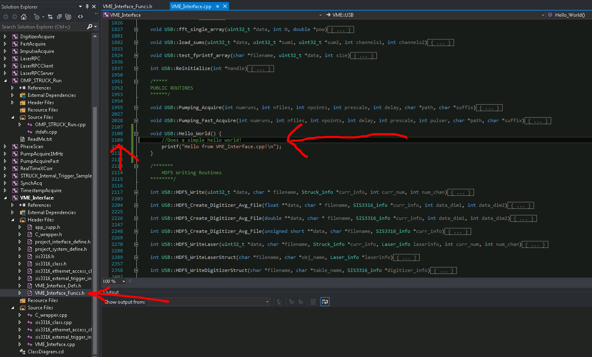

# Tutorial: Adding a Function to the VME Interface Library in C++.
## By Sean Mattingly

This is a short tutorial which shows how to add a function to the VME_Interface DLL.

* * *

1.  Go to “Start” -> Open “Visual Studio 2015.” Note there are older version of VS2015; do not use them.
2.  In the Visual Studio startup screen, select “Open Project…” under “Start.” Alternatively, you can do File -> Open -> Project / Solution (Ctrl + Shift + O).

3.  In the file dialog that opens, go to “My Documents” -> “Visual Studio 2015” (NOT 2013 or 2010) -> “Projects” -> “VME_Interface” -> VME_Interface.sln. Alternatively, the full file path is C:\Users\SKIFFLAB\Documents\Visual Studio 2015\Projects\VME_Interface\VME_Interface.sln. Click “Open” to open the solution.
4.  MSVS2015 will open the full solution. There are a variety of projects inside this solution for different data acquisition processes. Navigate to the “VME_Interface” library and select the VME_Interface.cpp source file: .
5.  Now let's add a new function to the VME_Interface.cpp library. It's going to be a basic public function.
6.  In "VME_Interface_Funcs.h," create a function prototype:

```c++
		static VMEFUNCSDLL_API void USB::Hello_World();
```

Here, VMEFUNCSDLL_API is a #define statement that correctly determines whether the function definition is for a DLL
export or an import.

7.  In "VME_Interface.cpp" define the function:

```c++
	void USB::Hello_World() {
		//Does a simple hello world!
		printf("Hello from VME_Interface.cpp!\n");
	}
```

8.  Hit Ctrl + Shift + B and build it. Note that a LOT of building is going to happen - everything depends on this DLL!

* * * 

This would be a good place to try to link to this new function, or a new function, using the methods outlined
in the other tutorial: [Creating a Project that calls a function from VME_Interface.dll](../Calling_DLL/cpp_file_calling_VME_Interface.md)
